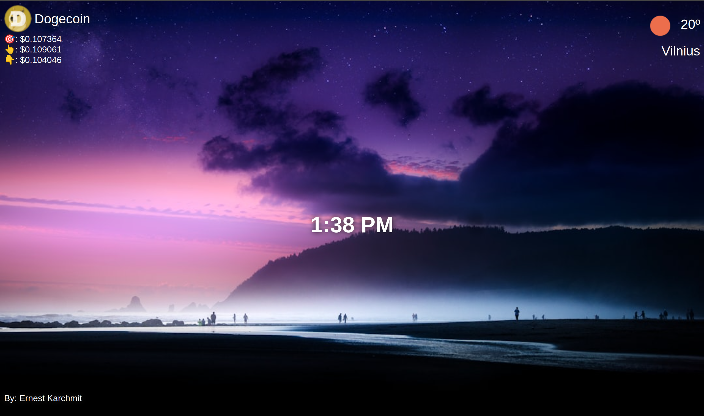
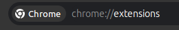
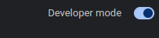

<!-- PROJECT LOGO -->

<h3 align="center">personal-dashboard</h3>

  <p align="center">
    Simple personal dashboard extension for chrome
    <br />
    <br />
    <a href="https://personal-dash-board-extension.netlify.app/">View Demo</a>
    ·
    <a href="https://github.com/shpokas270/personal_dash-board-chrome-extension/issues">Report Bug</a>
    ·
    <a href="https://github.com/shpokas270/personal_dash-board-chrome-extension/issues">Request Feature</a>
  </p>
</div>

<!-- TABLE OF CONTENTS -->
<details>
  <summary>Table of Contents</summary>
  <ol>
    <li>
      <a href="#about-the-project">About The Project</a>
      <ul>
        <li><a href="#built-with">Built With</a></li>
      </ul>
    </li>
    <li>
      <a href="#prerequisites">Prerequisites</a>
    </li>
    <li>
      <a href="#installation">Installation</a>
    </li>
    </li>
    <li><a href="#contact">Contact</a></li>
    <li>
      <a href="#left-to-do">Left to do</a>
    </li>
  </ol>
</details>

<!-- ABOUT THE PROJECT -->

## About The Project

Welcome to chrome extension project it contains:

- Weather info based on your location using API
- Crypto latestinfo using API
- Background img loaded from an API
- Time is based on where you are



<p align="right">(<a href="#readme-top">back to top</a>)</p>

### Built With

- ![JavaScript][JavaScript]
- ![HTML5][HTML5]
- ![CSS3][CSS3]

<p align="right">(<a href="#readme-top">back to top</a>)</p>

<!-- GETTING STARTED -->

### Prerequisites

### Installation

1. Clone the repo
   ```sh
   git clone https://github.com/shpokas270/personal_dash-board-chrome-extension.git
   ```
2. Navigate to chrome://extensions
   

3. Enable developer mode top right corner
   

4. Load unpacked and choose cloned repo folder

5. Open new chrome window

<p align="right">(<a href="#readme-top">back to top</a>)</p>

<!-- LEFT TO DO -->

### Left to do

<ul>
<li>nothing!</li>
</ul>

<!-- CONTACT -->

## Contact

Skirmantas Spakovskis - [@LinkedIn](https://www.linkedin.com/in/skirmantasspakovskis/) - skirm.spak@gmail.com

Project Link: (https://github.com/shpokas270/personal_dash-board-chrome-extension)

<p align="right">(<a href="#readme-top">back to top</a>)</p>

<!-- MARKDOWN LINKS & IMAGES -->
<!-- https://www.markdownguide.org/basic-syntax/#reference-style-links. -->

[NPM]: https://img.shields.io/badge/NPM-%23000000.svg?style=for-the-badge&logo=npm&logoColor=white
[Webpack]: https://img.shields.io/badge/webpack-%238DD6F9.svg?style=for-the-badge&logo=webpack&logoColor=black
[Vite]: https://img.shields.io/badge/Vite-B73BFE?style=for-the-badge&logo=vite&logoColor=FFD62E
[JavaScript]: https://img.shields.io/badge/javascript-%23323330.svg?style=for-the-badge&logo=javascript&logoColor=%23F7DF1E
[HTML5]: https://img.shields.io/badge/html5-%23E34F26.svg?style=for-the-badge&logo=html5&logoColor=white
[CSS3]: https://img.shields.io/badge/css3-%231572B6.svg?style=for-the-badge&logo=css3&logoColor=white
[product-screenshot]: public/images/prev.png
